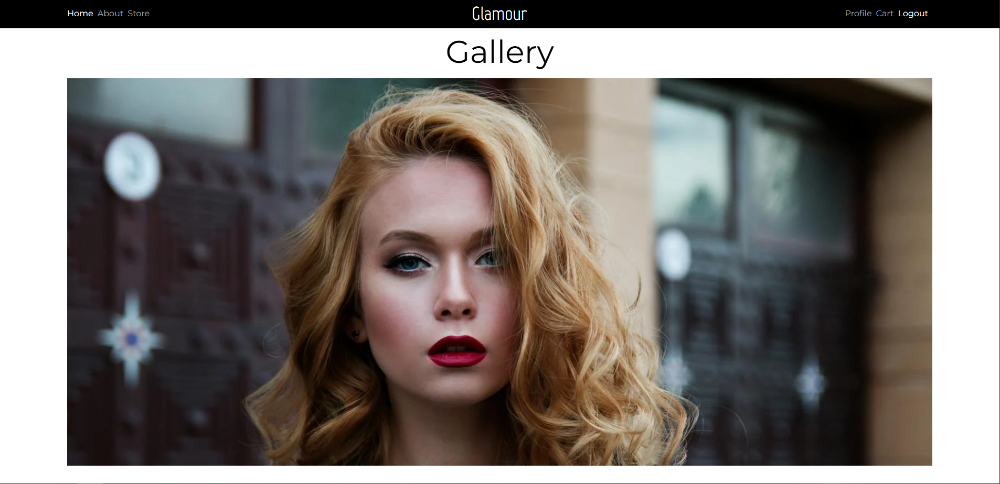
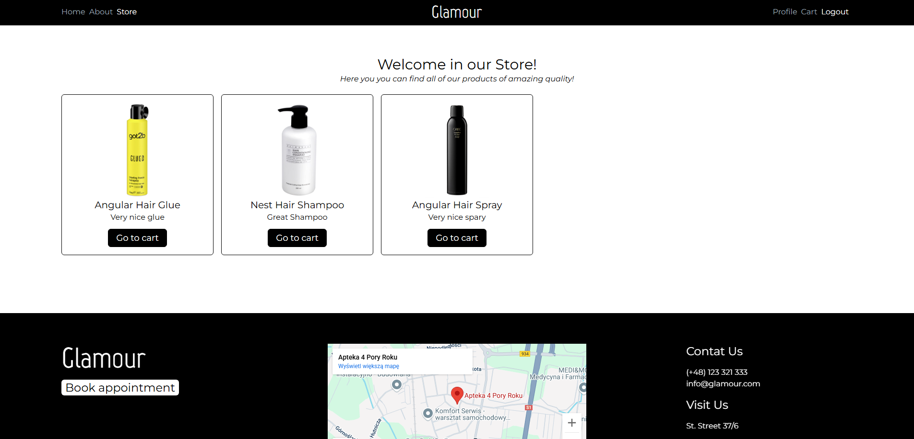
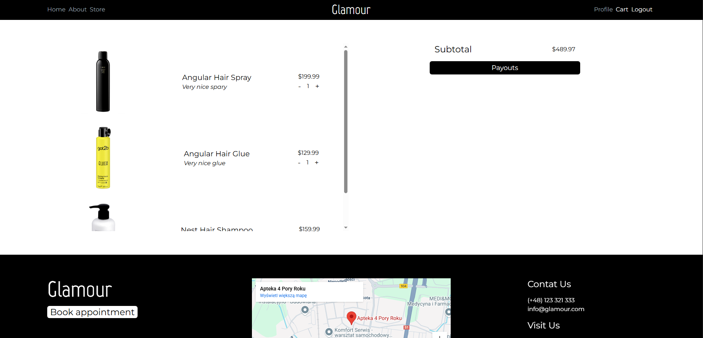
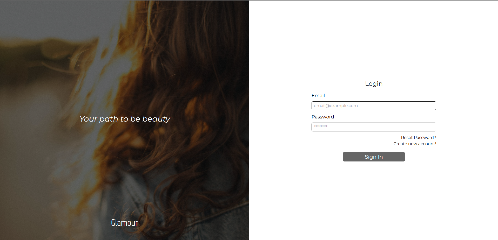

# 💻 Glamour Hair Salon

Website for the glamour hair salon company presenting the salon, allowing registration and purchase of products.

## 🛠️ Technologies

- Angular 19
- NestJS 11
- TypeScript
- TailwindCSS
- Firebase
- Stripe
- Docker
- Render.com (hosting)

## 🎯 Features

- ✅ Home page with description & image gallery
- ✅ Advanced Authorization & Authentication (JWT with Refresh Token passed by cookies)
- ✅ Products list with possibility to buy
- ✅ Possibility to reset password (Mailing System)
- ✅ Responsive design
- ✅ API Secure
- ✅ Use store tools on frontend (NgRX)
- ✅ Docker
- ✅ Cart logic
- ✅ Advanced architecture of appliaction (Frontend and Backend)

## 🌐 Demo
- 🔗 [https://glamour-hair-salon.onrender.com/home](https://glamour-hair-salon.onrender.com/home)

## 🧠 Author
- Daniel Miliczek
- GitHub: @ShadowBlack77

## 📸 Screenshots

